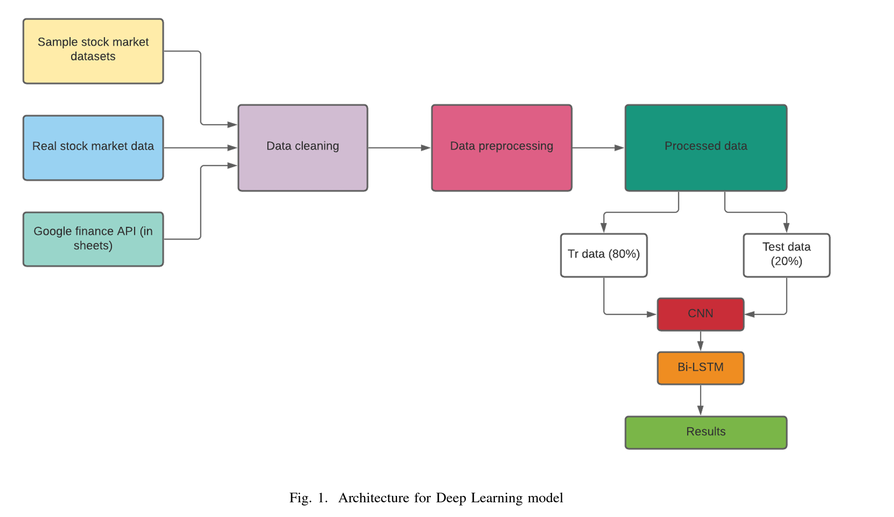
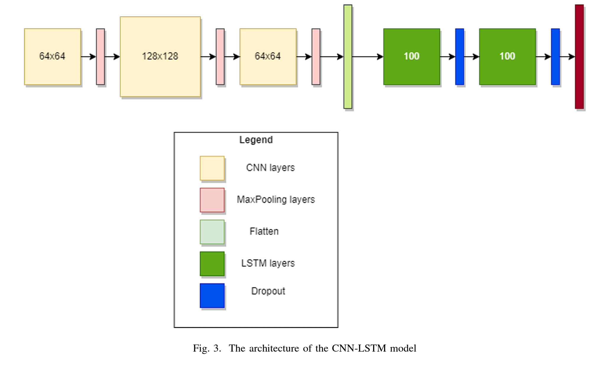
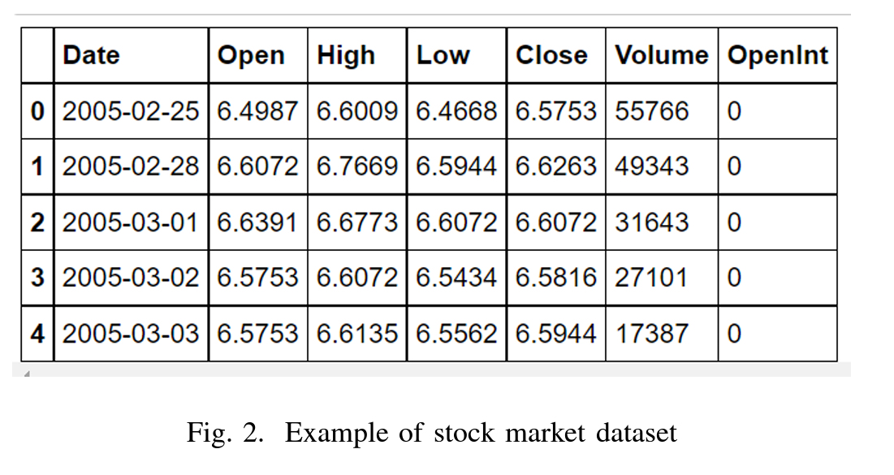

# LSTM Network Analysis for Stock Price Prediction

An LSTM network was developed to predict future trends of stock prices in 15-minute intervals, utilizing historical price data and technical analysis indicators. The model achieved an average accuracy of 55.9% in predicting the near-term upward or downward movements of a stock's price.

## Comparative Study of Deep Learning Models

Selvin, Menon, Soman et al. explored the efficacy of three deep learning models: CNN, RNN, and LSTM, employing a sliding window approach.

- **CNN** was found to be superior in terms of accuracy compared to RNN and LSTM. The CNN model's advantage is attributed to its use of only the current window's information for prediction, enabling it to capture dynamic changes and patterns effectively.
- **RNN and LSTM**, in contrast, incorporate information from previous time steps, which affects their predictive capability for future instances.

## Intelligent Decentralized Stock Market Model

Bansal, Hasija et al. introduced an innovative decentralized stock market model integrating machine learning with DAG-based cryptocurrency. Their LSTM-based ML model demonstrated an exceptional prediction accuracy of 99.71%. The model's feature vector included four key parameters: open, close, low, and high prices, with a batch size of 50 over 100 epochs.

## Adoption of CNN-LSTM Neural Network

We opted for a CNN-LSTM Neural Network due to the complementary strengths of CNN and LSTM in feature and pattern recognition, respectively, which is crucial for our time-series dataset.

- The project's code and resources can be found on [GitHub](https://github.com/Circle-1/Stock-X).
- 

### Data Preparation and Analysis

- Data spanning ten years was stored in CSV format for the testing phase.
- An Exploratory Data Analysis was conducted to gain insights into the data.

#### Preprocessing Phase

The preprocessing involved data cleansing (removal of NULL values and mean substitution) and extraction of the four main stock market dataset columns: Open, Close, High, and Low. Notably, the Close column is pivotal for training.

- Graphical representations were created using matplotlib and seaborn libraries.
- 

#### Data Transformation for CNN

A function was devised to convert 1-D arrays into tensors, facilitating the training of the CNN model. After tensor transformation, the dataset was split (80% training, 20% testing), and data reshaping was performed for training initiation.

- 

### Neural Network Architecture

- The CNN section comprises three layers with neuron sizes 64, 128, and 64, kernel size of 3, and includes MaxPooling and Flatten layers for tensor manipulation.
- The LSTM section includes two Bi-LSTM layers with 100 neurons each, enhanced with dropout layers (0.5 rate) for feature selection stability.
- The model utilizes the "adam" optimizer, Mean Squared Error (MSE) loss function, and tracks MSE and MAE metrics.

The model's architecture facilitates a robust approach to time-series problem-solving, combining CNN's feature extraction capabilities with LSTM's sequential data processing strength.
